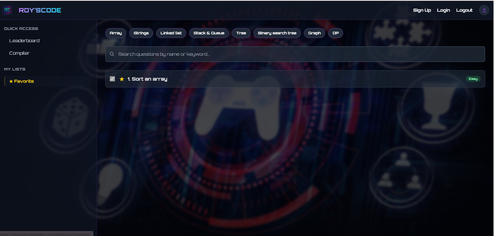
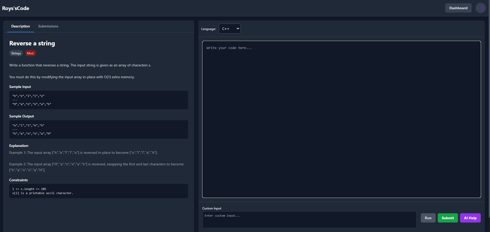
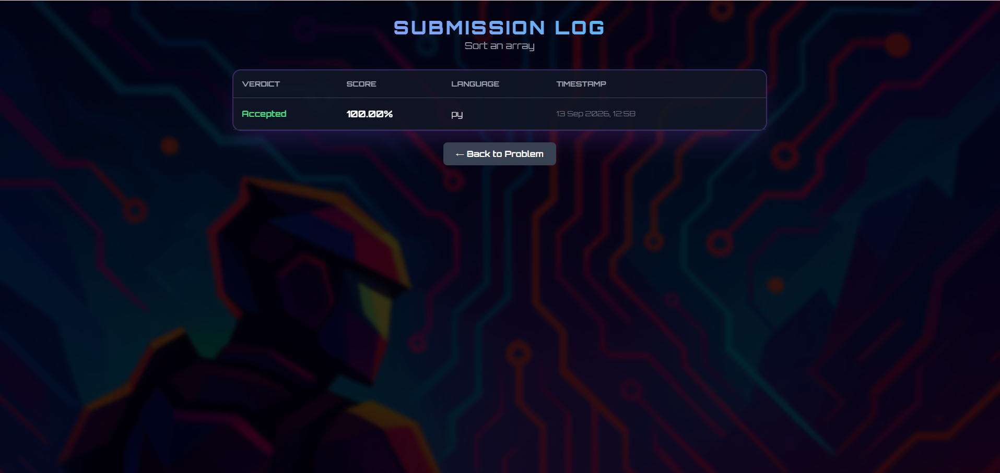
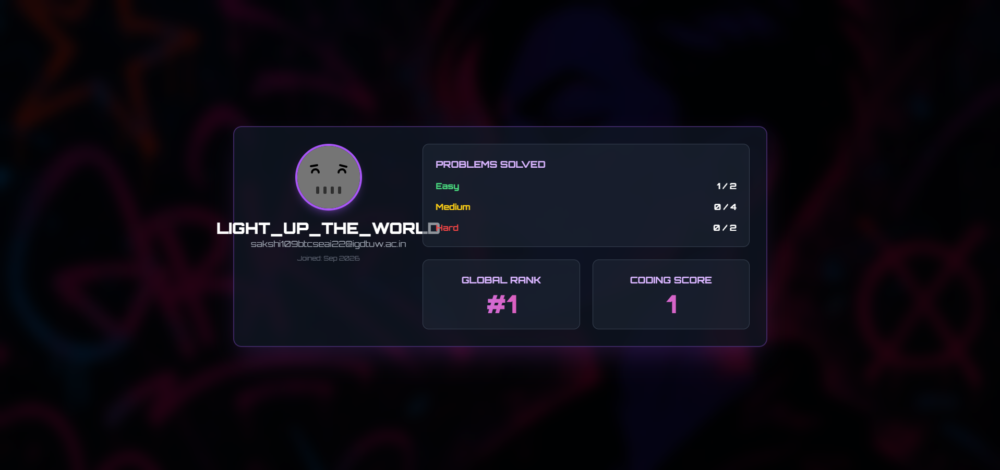
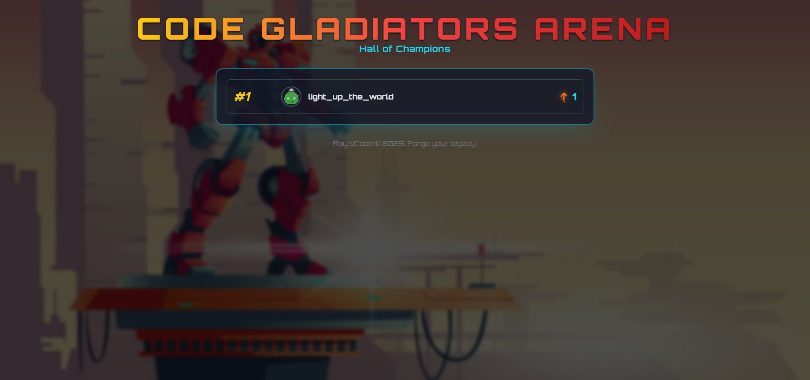
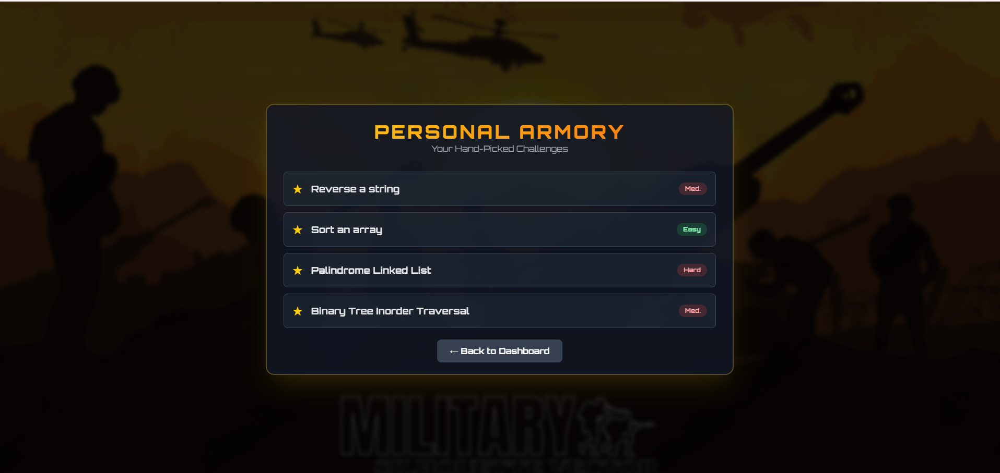
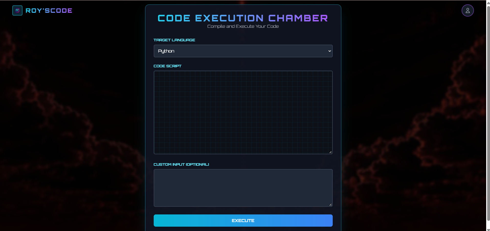
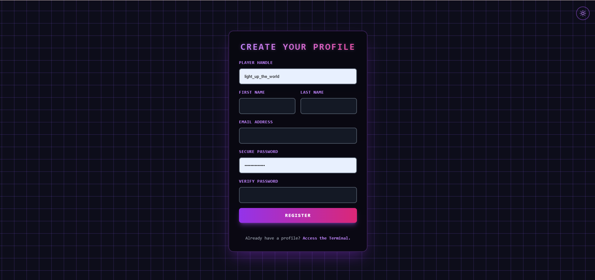
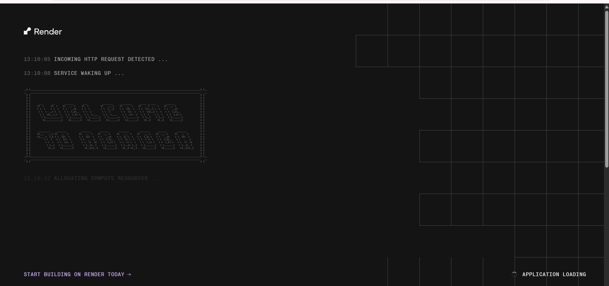

<p align="center">
  
</p>

<h1 align="center">RoysCode — Online Judge</h1>

<p align="center">
  A competitive-programming judge built with Django. Register, browse problems
  by topic, write C++ or Python in the browser, and get a verdict scored
  against hidden test cases — with an AI assistant that explains failures.
</p>

<p align="center">
  <a href="https://royscode.onrender.com"><b>▶ Live demo</b></a>
</p>

<p align="center">
  
  
  
  
  
</p>

---


---

## Contents

- [What it does](#what-it-does)
- [Walkthrough](#walkthrough)
- [How the judge works](#how-the-judge-works)
- [Tech stack](#tech-stack)
- [Running it locally](#running-it-locally)
- [Tests](#tests)
- [Deployment](#deployment)
- [Known limitations](#known-limitations)

---

## What it does

- **Accounts** — registration and session-based sign-in on Django's auth
- **Problem catalogue** — filter by topic, search by title, favourite for later
- **In-browser editor** — C++ and Python, syntax highlighted
- **Run vs Submit** — *Run* executes against your own input; *Submit* scores
  against the full hidden test set
- **Per-case verdicts** — which cases passed, with input, expected and actual
  output for the visible ones
- **AI assistance** — Google Gemini explains failures and suggests fixes
- **Submission history** — every attempt, with language, verdict and score
- **Leaderboard and profile** — global rank and solve counts by difficulty
- **Scratchpad compiler** — run code standalone, no problem attached

---

## Walkthrough

### Dashboard

Problems grouped by topic, with solved state and favourites. Search and topic
filters run server-side.



### Solving a problem

Statement, constraints and sample I/O on the left; editor and verdict panel on
the right. Each problem states its exact input and output format, because the
judge compares stdout byte-for-byte.



### Submission history

Every attempt is recorded with its language, verdict and score.



### Profile and leaderboard

Solve counts split by difficulty, a progress ring, and global rank computed
from confirmed solves only — favouriting a problem does not count.

<table>
<tr>
<td></td>
<td></td>
</tr>
</table>

### Favourites and the standalone compiler

<table>
<tr>
<td></td>
<td></td>
</tr>
</table>

### Authentication

<table>
<tr>
<td></td>
<td></td>
</tr>
</table>

---

## How the judge works

The interesting part of this project is what happens between clicking Submit
and seeing a verdict.

```
POST /question/<id>/submit/
      │
      ├── write submission to codes/<uuid>.{cpp,py}
      ├── write each test input to inputs/<uuid>.txt
      │
      ├── C++ ──► g++ compile ──► run binary, stdin ◄── input file
      │           └── compile error? return it as the verdict
      │
      ├── Python ► run interpreter, stdin ◄── input file
      │
      ├── compare stdout to expected, case-sensitive, per case
      │
      └── score = passed / total × 100
          └── 100%? mark the question solved for this user
```

Submissions run as subprocesses behind two guardrails:

- **A 5-second timeout** per execution, so an infinite loop returns a
  `Timeout` verdict rather than holding a worker forever.
- **A stripped environment** — child processes get a minimal `PATH` and
  nothing else. Without it, a three-line Python submission could print
  `os.environ` and walk off with the database URL and API keys.

Test cases are split into visible and hidden. Visible cases show their
expected output so users can debug; the score comes from the full set.

---

## Tech stack

| Layer | Choice |
|---|---|
| Backend | Django 5.2, server-rendered, 4 apps |
| Database | PostgreSQL via `dj-database-url` |
| Frontend | Django templates + Tailwind CSS |
| Execution | `subprocess` with `g++` and CPython, timeout + env isolation |
| AI | Google Gemini (`google-generativeai`) |
| Static files | WhiteNoise, compressed and hashed manifest |
| Server | Gunicorn |
| Container | Docker, multi-stage build |
| Hosting | Render (web) + Neon (Postgres) |

**Apps** — `sign_up` (auth), `dashboard` (catalogue, favourites, leaderboard,
profile), `problem_detail` (problem view, judging, history), `compile`
(standalone compiler).

**Models** — `Topic`, `Question`, `TestCase`, `CodeSubmission`,
`UserSolvedQuestion`.

---

## Running it locally

Requires Python 3.13 and `g++` on PATH.

```bash
git clone https://github.com/sakshiroy2026/online_judge.git
cd online_judge

python -m venv env
source env/bin/activate          # Windows: .\env\Scripts\activate
pip install -r requirements.txt

python extract_media.py          # unpack test-case files from media.zip
python manage.py migrate
python manage.py loaddata initial_data.json
python manage.py createsuperuser
python manage.py runserver
```

With no `DATABASE_URL` set it falls back to SQLite, so Postgres isn't needed
for local work.

### Environment variables

| Variable | Required | Purpose |
|---|---|---|
| `SECRET_KEY` | production | Django signing key |
| `DEBUG` | production | Set to `False` |
| `DATABASE_URL` | production | Postgres connection string |
| `GOOGLE_API_KEY` | optional | Enables the AI assistant |

---

## Tests

```bash
python manage.py test
```

20 tests covering migrations and fixture loading, every route's status code,
login gating, registration, the solved-vs-favourited distinction, profile
statistics, and the judge itself — including that submissions cannot read
environment secrets, that infinite loops time out, and that output comparison
stays case-sensitive.

Tests build a throwaway database from the migrations, so a migration that
would fail in production fails locally first.

---

## Deployment

Docker image built from the included `Dockerfile`, running on Render's free
tier against a Neon Postgres instance. `start.sh` applies migrations and loads
the problem fixture on boot, since the free tier gives no shell access.

The image installs `build-essential` so `g++` exists at runtime — the judge
shells out to it directly rather than using a separate worker.

---

## Known limitations

Stated plainly rather than left to be discovered:

**Cold starts.** Free Render services sleep after 15 minutes idle. The first
request afterwards takes roughly 50 seconds while the container wakes.



**Execution isolation is process-level, not container-level.** Submissions are
bounded by a timeout and a stripped environment, but they share the web
container. A production judge would run each submission in its own
short-lived container with cgroup memory and CPU limits.

**No submission queue.** Judging happens inline in the request. Fine at demo
traffic, wrong under load.

**Three problems have no hidden test cases yet**, so Submit and Run evaluate
the same set for those.
